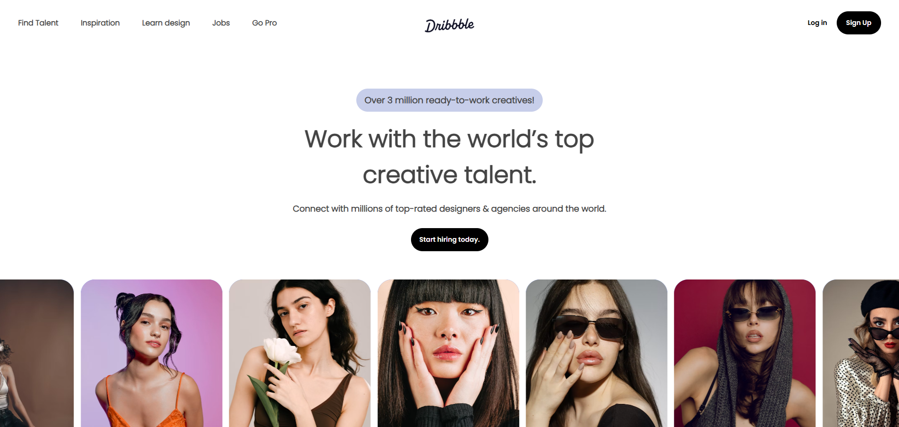

# 🌐 Stylized Websites Templates

This repository contains a collection of practice website templates built using **HTML** and **CSS**.  
Each project lives in its own folder and includes a **preview image** showing the final look of the webpage.

---

## 📁 Projects Overview

Click on any project name below to open its folder.  
Each preview image gives you a quick idea of what the final page looks like.

> 💡 Tip: Open the `index.html` inside each project folder in your browser to see the live webpage.

---

## 📸 Project Previews

| Project Folder Name | Preview |
|----------------------|---------|
| [Dribble-Project](./Dribble-Project) |  |
| [Flex Sample Shopping](./Flex%20Sample%20Shopping) |  |
| [Grid Fashion Page](./Grid%20Fashion%20Page) |  |
| [Grid Responsive Page](./Grid%20Responsive%20Page) |  |
| [Premier-Website Page](./Premier-Website%20Page) |  |
| [Trendline-Fashion Page](./Trendline-Fashion%20Page) |  |

---

## ⚙️ How to Use

1. Clone this repository:
   ```bash
   git clone https://github.com/Aryan-Atom/Stylized-Websites-Templates.git
